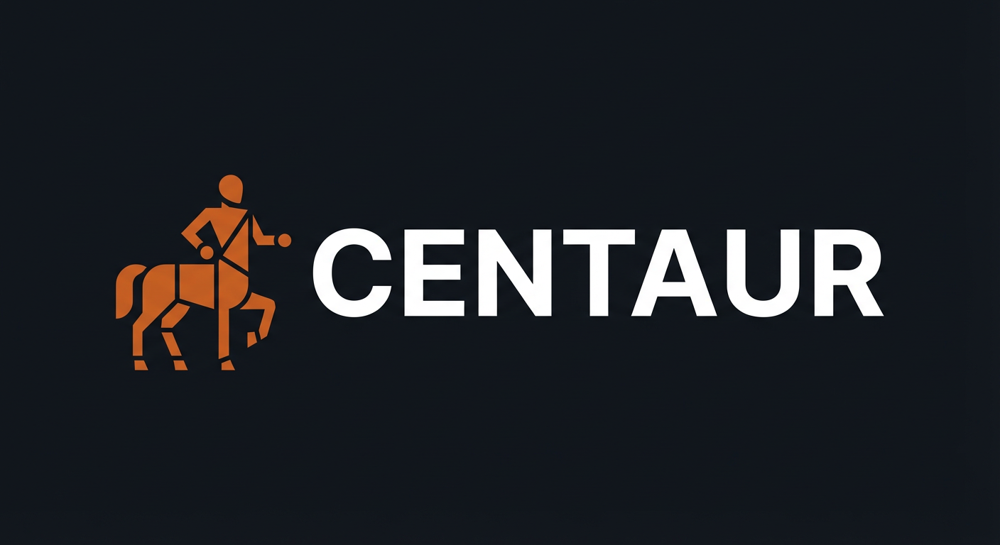

<h1 align="center">

</h1>

<h4 align="center">
    Self-hosted AI agent platform: give your team a shared agent that can use your tools, run durable workflows, and never see your secrets.
</h4>

<p align="center">
  <a href="#whats-centaur">What's Centaur?</a> •
  <a href="#architecture">Architecture</a> •
  <a href="#durable-workflows">Durable Workflows</a> •
  <a href="#security-model">Security Model</a> •
  <a href="./AGENTS.md">Developer Guide</a>
</p>

## What's Centaur?

Most teams using AI agents hit the same wall: one engineer gets a great setup, but nobody else can replicate it. Everyone configures their own tools, manages their own keys, and builds their own workflows from scratch. There's no shared infrastructure, no compounding, and no way to trust the agent with real credentials.

Centaur fixes this. Deploy an AI agent that your whole team can talk to — in Slack or via API — with shared tools, durable multi-step workflows, and security that doesn't require trusting the agent with your keys. One person builds a workflow, and the entire team has access immediately.

### Add once, everyone benefits

Someone writes a 20-line Python file that checks CI every 5 minutes and posts results to Slack. They drop it in [`workflows/`](workflows/). Now every team has that capability — no setup, no configuration, no asking an engineer. The same applies to [tool plugins](tools/): add a new API integration, and every agent conversation can use it instantly. Over 60 tools ship out of the box, all hot-reloadable with zero downtime.

### Durable agents that run for hours or days

Most agent runtimes handle a single request-response turn. Centaur's [durable workflow engine](AGENTS.md#durable-workflows) lets agents run for hours or days — sleeping between polling iterations, waiting for external webhooks, chaining parent→child agent turns — all with exactly-once step execution backed by Postgres. Cron schedules are built in. A daily digest, a recurring monitor, a multi-step approval pipeline — these are just Python functions that checkpoint and resume.

### The agent never sees your secrets

Each conversation runs in an isolated Kubernetes Pod governed by NetworkPolicies. A [MITM proxy](services/firewall/) injects real credentials at the network boundary -- the agent never holds them directly. It can make authenticated API calls through the proxy, but it can't extract keys, reach internal services, or operate undetected. Every outbound request is audit-logged. Response bodies are scanned for leaked secrets and redacted in real-time.

### Bring any agent runtime

Not locked to a single AI harness. Run [Amp](https://ampcode.com), Claude Code, Codex, or any CLI-based agent inside the sandbox. The container ships with Node.js, Rust, Python, and git — agents can `git clone`, `cargo build`, and run tests in a real Linux environment.

### Small, auditable core

Centaur's entire security-critical core is **~5,400 lines of Python**: the [API](services/api/) (3,900), [firewall](services/firewall/) (1,000), and [secrets manager](services/secrets/) (470). That's what runs your agents, guards your keys, and enforces isolation. Everything else — 60+ [tool plugins](tools/), [durable workflows](AGENTS.md#durable-workflows), a [Slack interface](services/slackbot/), observability — is a leaf-node integration that doesn't touch auth, secrets, or sandbox boundaries.

## Architecture

```
                           Slack
                             |
                      events / webhooks
                             v
        ┌───────────────────────────────────────────────┐
        │ nginx (:80, host :8000 by default)            │
        │ public edge; routes enabled via env           │
        └───────────────────────┬───────────────────────┘
                                │ default: slackbot only
                                v
        ┌───────────────────────────────────────────────┐
        │ slackbot (Next.js, :3001)                     │
        │ health endpoint + Slack webhook surface       │
        └───────────────────────┬───────────────────────┘
                                │ spawn / message / execute
                                v
        ┌───────────────────────────────────────────────┐
        │ api (FastAPI :8000)                           │
        │ durable control plane + tools + admin         │
        │ workflow engine (checkpoint/replay)            │
        └───────────────┬───────────────┬───────────────┘
                        │               │
                        │ DB pool       │ Kubernetes API
                        v               v
              ┌────────────────┐   ┌──────────────────────┐
              │ pgbouncer      │   │ sandbox Pods         │
              └──────┬─────────┘   │ centaur-agent        │
                     │             └──────────┬───────────┘
                     v                        │ tool calls + HTTPS proxy
              ┌────────────────┐              v
              │ Postgres       │
              │ durable state  │
              └────────────────┘
              ┌────────────────┐     ┌────────────────────┐
              │ secrets        │────>│ firewall           │────> external LLMs
              │ 1Password/env  │     │ mitmproxy          │      + external APIs
              └────────────────┘     └────────────────────┘

        Observability: api / slackbot / firewall / fluentbit ->
                       VictoriaLogs + VictoriaMetrics -> Grafana
```

## Durable Workflows

The workflow engine uses checkpoint/replay — the handler function IS the workflow, and steps are checkpointed to Postgres. On resume after crash or suspension, the handler re-executes top-to-bottom but skips steps that already have results. Loops, branches, and conditionals work naturally because it's just Python.

```python
# workflows/my_workflow.py — drop this file in and it's live
WORKFLOW_NAME = "my_workflow"

async def handler(inp, ctx):
    data = await ctx.step("fetch", lambda: fetch_data(inp.query))
    await ctx.sleep("wait", timedelta(minutes=5))
    result = await ctx.run_agent("analyze", text=f"Summarize: {data}")
    return {"data": data, "analysis": result}
```

**Primitives**: `ctx.step()` (exactly-once execution), `ctx.sleep()` / `ctx.sleep_until()` (durable suspend), `ctx.wait_for_event()` (external webhook), `ctx.run_agent()` (spawn a child agent turn), `ctx.run_workflow()` (child workflow). Cron and interval schedules are built in.

**REST API**: `POST /workflows/runs` (create), `GET /workflows/runs/{id}` (inspect), `POST /workflows/runs/{id}/cancel`, `POST /workflows/events` (deliver external events to waiting runs).

See the [Developer Guide](AGENTS.md#durable-workflows) for full API reference, built-in workflows, and the WorkflowContext API.

## How It Compares

| | Centaur | OpenClaw | IronClaw |
|---|---|---|---|
| **Process model** | 1 conversation = 1 isolated Kubernetes Pod | Single Node.js process, full system access | WASM sandbox per tool |
| **Secrets** | MITM proxy injection — agent can't extract keys, but can make calls through the proxy | `~/.openclaw/credentials/` with file perms | Host boundary injection (WASM only) |
| **Blast radius** | Pod isolated by NetworkPolicy, method-filtered, rate-limited | Agent has shell, filesystem, browser, credentials | WASM sandbox, limited to declared capabilities |
| **Audit logging** | Every outbound request audit-logged via firewall; all container logs auto-collected into VictoriaLogs | None built-in | None built-in |
| **Agent runtime** | Harness-agnostic (Amp, Claude Code, Codex, any CLI) | Locked to OpenClaw's runtime | Locked to IronClaw's runtime |
| **Real engineering** | Full Linux sandbox — `git clone`, `cargo build`, run tests | Yes (but with full host access) | WASM — can't run arbitrary code |
| **Tools & skills** | API-mediated plugins + [`SKILL.md`](.agents/skills/) workflow instructions, hot-reloadable | 100+ AgentSkills with local access | WASM tools, hot-loadable |

## Security Model

Centaur's security is defense in depth — no single layer is a silver bullet, but the combination makes compromise expensive and detectable.

### What an attacker cannot do

- **Extract credentials**: The agent never holds real API keys. Credentials exist only in the secrets manager and are only delivered in-flight by the firewall. Sandbox Pods see only key _names_ as placeholder values (e.g. `OPENAI_API_KEY=OPENAI_API_KEY` in the environment) -- the real secret values never appear in the Pod's environment, filesystem, or memory.

- **Move laterally**: Sandbox Pods are isolated by Kubernetes NetworkPolicies. SSRF protection blocks requests to private IPs by resolving hostnames before forwarding. The database, secrets manager, and observability stack are not reachable from sandboxes except through explicitly allowed service paths. Redirect responses to internal IPs are also blocked.

- **Use credentials on the wrong host**: Tools declare which API hosts and secret keys they need in their `pyproject.toml`. The API builds a host→keys injection map and pushes it to the firewall. A Slack tool's token can't be injected into an Etherscan request — the firewall strips unmatched key placeholders and logs the violation.

- **Escalate privileges**: Each sandbox gets an HMAC-SHA256 signed token (`sbx1.*`) bound to its thread and sandbox ID, time-limited to 2 hours, with scopes restricted to `agent` and `tools:*` only. No admin access, no secrets endpoints, no key management. Database-backed API keys enforce fine-grained scopes (`admin`, `agent:execute`, `tools:<name>`, `threads:read`).

- **Smuggle key names past the firewall**: The firewall applies NFKC unicode normalization, strips zero-width characters, and maps Cyrillic/Greek homoglyphs before scanning for key name placeholders. Header values that don't match the outbound allowlist are stripped entirely. User-Agent is forced to a fixed value.

- **Operate undetected**: Every outbound request is audit-logged with method, host, path, status, request/response bytes, duration, and source container IP. Response bodies from LLM APIs are scanned for leaked secret values and redacted in real-time.

### What an attacker can do

- **Make authenticated requests through the proxy**: A compromised container can make API calls that the firewall will authenticate — this is by design, since the agent needs to call LLM APIs to function. The firewall limits this with HTTP method restrictions (non-allowlisted hosts are GET-only), per-source-IP rate limits (500 req/min default), and the injection map (credentials only go to declared hosts). But within those limits, a hijacked agent can make arbitrary calls to any API host it's authorized for.

- **Call any registered tool**: The agent can invoke any tool via the API. Centaur scopes tool access per API key, but sandboxes currently get `tools:*` scope which grants access to all registered tools.

- **Read data returned by API calls and tools**: The agent sees full responses from LLM APIs and tools it invokes. Response scanning redacts known secret values, but the agent sees all other data.

- **Potentially root the sandbox**: The sandbox is a Kubernetes Pod, not a VM. Container escapes are a known risk class. Centaur mitigates with resource limits, read-only host mounts where used, least-privilege service accounts, and NetworkPolicies that keep sandboxes away from internal control-plane services.

### Architecture decisions that enforce this

- **Scoped sandbox tokens**: HMAC-SHA256 signed, thread+container bound, 2-hour TTL, minted on spawn and refreshed when claiming from the warm pool.

- **Per-host injection maps**: Built from tool manifests, pushed to the firewall on startup and on every hot-reload. Wildcard host patterns (`*.domain.com`) are supported. Catch-all domains and raw IPs are rejected.

- **Kubernetes NetworkPolicies**: The chart denies traffic by default and then explicitly allows API, pgbouncer, Postgres, secrets, firewall, Slackbot, DNS, and sandbox egress paths needed for the local deployment.

- **Warm pool**: Pre-spawned sandbox Pods eliminate cold-start latency. The pool auto-replenishes, recovers on API restart, and mints fresh scoped tokens on claim.

- **Tool REST API**: Tools auto-generate endpoints at `/tools/{name}/{method}` with scope-checked access and method introspection. The API serves as a hosted tool server — sandboxes call it via `curl`, no MCP protocol needed.

## Getting Started

See the [Developer Guide](./AGENTS.md) for full setup instructions, architecture details, and API reference. The short version:

```sh
git clone <repo-url>
cd centaur
brew install just              # if needed
export OP_SERVICE_ACCOUNT_TOKEN=... OP_VAULT=...
export SLACK_BOT_TOKEN=... SLACK_SIGNING_SECRET=... SLACKBOT_API_KEY=...
just up
```

## Database Migrations

Use `./scripts/dbmate new add_agent_leases` to create the next numbered migration in `services/api/db/migrations`.

Use `./scripts/dbmate up`, `./scripts/dbmate status`, or any other `dbmate` subcommand to run migrations against the same `DATABASE_URL` the API service uses. If `DATABASE_URL` is not set in your shell, the wrapper reads it from the running `api` container.

## Contributing

Centaur is built by open source contributors like you, thank you for improving the project!

The [Developer Guide](./AGENTS.md) covers architecture, code conventions, and how to add tools. Each service has its own `pyproject.toml` and `ruff.toml`. Pull requests will not be merged unless CI passes.

## Acknowledgements

Centaur builds on excellent open-source infrastructure:

- [Amp](https://ampcode.com): The primary AI coding agent harness used inside the sandbox.
- [mitmproxy](https://mitmproxy.org/): Powers the firewall's credential injection via HTTPS interception.
- [FastAPI](https://fastapi.tiangolo.com/): The API server framework.
- [Kubernetes](https://kubernetes.io/): Pod orchestration and NetworkPolicy isolation for agent sandboxes.

## Links

- [Amp](https://ampcode.com)
